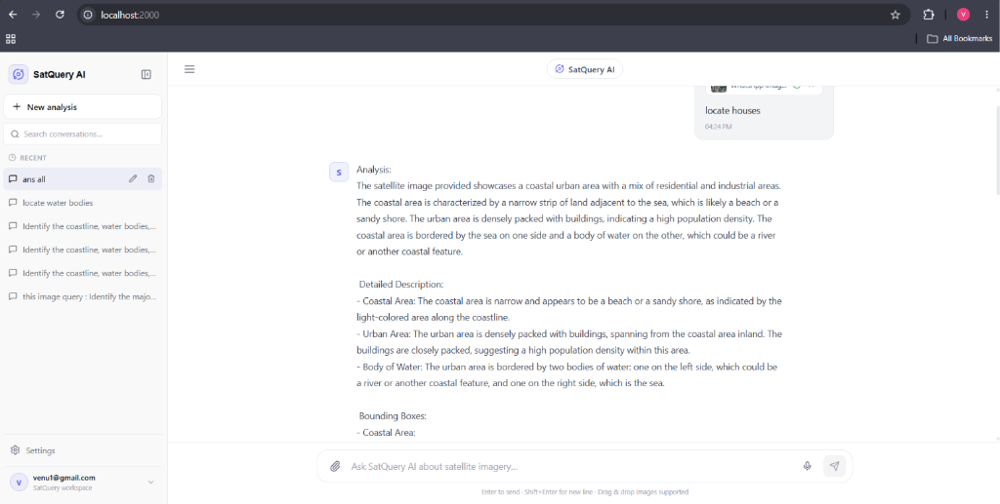
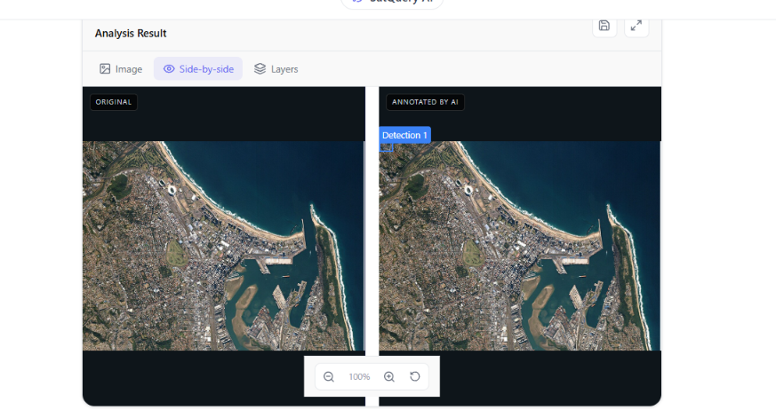

# SatQuery AI

SatQuery AI is a multimodal AI platform built for ISRO's Smart India Hackathon 2024. It lets you upload satellite imagery and ask questions about it in plain English. The system analyzes the image using a fine-tuned Vision Language Model, draws bounding boxes around detected features, and shows the result in a side-by-side annotated viewer alongside a structured textual response.

The model runs entirely on-device without any external API calls to OpenAI, Gemini, or any other cloud AI service.

## Screenshots

The following screenshots show the working model running locally.

Chat Interface with Structured AI Analysis



The AI produces a detailed, structured textual analysis explaining what it observes in the satellite image, including detected regions like coastal areas, urban density, and water bodies.

Side-by-side Annotated Image Viewer



After the analysis, you can open the image viewer which shows the original image on the left and the AI-annotated version on the right with bounding boxes drawn over detected features.

## Tech Stack

The project is split into two parts: a Python backend that handles AI inference and a React frontend that handles the user interface.

Backend is built with Python. Frontend is built with React using Vite as the build tool.

## Libraries Used

### Backend Libraries

| Library | Version | How it is used in SatQuery AI |
| --- | --- | --- |
| FastAPI | 0.115.6 | Serves all the REST API endpoints. Handles image uploads, query processing, authentication, and conversation history. |
| Uvicorn | 0.34.0 | Runs the FastAPI application as an ASGI server on port 4000. |
| SQLAlchemy | 2.0.36 | Manages the database schema and all queries for users, conversations, and analysis results stored in SQLite. |
| PyJWT | 2.10.1 | Creates and validates JSON Web Tokens used to authenticate users between the frontend and the backend. |
| bcrypt | 4.2.1 | Hashes user passwords before storing them so plain-text passwords are never saved to the database. |
| python-multipart | 0.0.20 | Parses the multipart form data when a user uploads a satellite image file through the browser. |
| python-dotenv | 1.0.1 | Loads environment variables from the .env file so secrets like the JWT key are not hardcoded in source files. |
| pydantic | 2.11.0 | Validates the shape and types of all incoming API request bodies and outgoing response objects. |
| Rasterio | 1.3.10 | Opens GeoTIFF files to extract geospatial metadata including CRS, lat/lon bounds, resolution, and band count. This context is injected directly into the AI prompt. |
| PyTorch | 2.5.1+cu121 | The core tensor computation framework that runs the entire neural network for the Vision Language Model inference. |
| Transformers (HuggingFace) | 5.17.0 | Loads the Qwen2.5-VL-3B-Instruct model architecture and the multimodal processor that tokenizes both text and image inputs together. |
| PEFT | 0.20.0 | Applies the trained LoRA adapter weights on top of the base Qwen2.5-VL model so the model specializes in satellite imagery without retraining all 3 billion parameters. |
| BitsAndBytes | 0.50.2 | Loads the model in 4-bit NF4 quantization so it fits and runs on consumer GPUs that do not have enough VRAM for full precision. |
| Accelerate | 1.15.0 | Handles device placement and memory management when loading the quantized model across available hardware. |
| qwen-vl-utils | 0.0.14 | Provides the process_vision_info utility that correctly prepares image tensors for the Qwen2.5-VL model visual encoder. |
| NumPy | 2.4.6 | Used inside the Rasterio pipeline to read band arrays and compute the NDVI index for vegetation analysis. |
| email-validator | 2.2.0 | Validates that email addresses provided during user registration are properly formatted before saving to the database. |

### Frontend Libraries

| Library | Version | How it is used in SatQuery AI |
| --- | --- | --- |
| React | 18.3.1 | Builds the entire user interface as reusable components including the chat window, image viewer, sidebar, and settings panel. |
| Vite | 6.0.5 | Bundles and serves the React application with hot module replacement during development and optimized output for production. |
| Lucide React | 0.468.0 | Provides all the icons used throughout the interface such as the satellite icon, layer controls, zoom buttons, and action toolbar icons. |
| Tailwind CSS | 3.4.16 | Used for base utility classes in the layout. The application also maintains a custom CSS file for the dark geospatial theme. |

## Project Structure

The project is divided into two cleanly separated layers: a Python AI backend and a React user interface frontend.

### Backend Structure (`/backend`)
```text
backend/
  ai_service/             AI model orchestration and context extraction
    real_service.py       Main Vision Language Model inference engine
    base.py               Abstract service definitions
    factory.py            Dependency injection factory
  app/
    main.py               FastAPI application entry point
    config.py             Application configuration and environment variables
    database.py           SQLAlchemy database connection setup
    routers/              API routes (auth, images, query, users)
    models/               SQLAlchemy ORM models
    schemas/              Pydantic validation schemas
    services/             Business logic for database operations
  requirements.txt        Production Python dependencies
  requirements-dev.txt    Development dependencies (e.g. Locust)
  .env.example            Environment variable template
```

### Frontend Structure (`/frontend`)
```text
frontend/
  src/
    main.jsx              Root React component and authentication context
    SatelliteViewer.jsx   Core image viewer with side-by-side annotation rendering
    components/
      chat/               Message list and input composer
      results/            AI analysis cards, bounding box lists, and execution summary
      image/              Drag-and-drop file upload zone
      layout/             Application shell, header, and sidebar
      settings/           User preferences and API configuration
    services/
      api.js              Axios HTTP client
      chatService.js      Conversation and query endpoints
      imageService.js     File upload endpoints
    styles.css            Custom CSS for the dark geospatial theme
  package.json            Node.js dependencies and Vite scripts
  vite.config.js          Vite bundler configuration
  index.html              HTML entry point
```

### Training & Model Weights (`/training`)
```text
training/
  scripts/
    satquery_inference.py Core ML pipeline for model evaluation
    train.py              LoRA fine-tuning script
    evaluate_satquery.py  Testing metrics and benchmarks
  models/
    satquery-best-lora/   148MB trained LoRA adapter (tracked with Git LFS)
```
## Architecture Overview

- **Frontend Client (React)**: Handles all user interaction, rendering the map and bounding boxes dynamically based on JSON responses.
- **Backend API (FastAPI)**: Serves as the orchestration layer between the frontend and the AI model, handling auth and image parsing.
- **Geospatial Engine (Rasterio)**: Extracts real-world bounding coordinates and projects image pixels to actual geographic lat/lon.
- **Vision Language Model (Qwen2.5-VL)**: Evaluates the parsed image, generates contextually aware textual answers, and precisely localizes features by returning coordinate vectors.

## Files Excluded from the Repository

The following are not committed because they are either too large, contain secrets, or are auto-generated.

```text
- .venv/ and node_modules/ - install these locally using pip install and npm install
- backend/.env - copy from backend/.env.example and fill in your values
- backend/uploads/ and uploads/ - user-uploaded images, created automatically at runtime
- backend/satquery.db - the SQLite database, created automatically on first startup
- training/data/ - raw and processed training datasets, not included due to size
- training/outputs/checkpoints/ - intermediate training checkpoints
- training/models/qwen25vl/ - the 6GB base model, downloaded automatically from HuggingFace at runtime
```

## Getting Started

You need Python 3.10 or higher and Node.js 18 or higher. A CUDA-compatible GPU is strongly recommended.

Clone the repository.

```bash
git clone https://github.com/codingseeker/Satquery.git
cd Satquery
```

Start the backend.

```bash
cd backend
python -m venv .venv
.venv\Scriptsactivate
pip install -r requirements.txt
cp .env.example .env
python -m uvicorn app.main:app --port 4000
```

Start the frontend in a second terminal.

```bash
cd frontend
npm install
npm run dev
```

Open http://localhost:2000 in your browser. Create an account, upload a satellite image, and start querying.

## Model

The AI model is Qwen2.5-VL-3B-Instruct fine-tuned with LoRA on ISRO remote sensing datasets. The base model weights are downloaded from HuggingFace automatically at runtime and the LoRA adapter is stored in 	raining/models/satquery-best-lora. The adapter file is tracked with Git LFS because it is approximately 148 MB.

When you run a query, the backend extracts geospatial context from the image using Rasterio, appends it to your query, runs inference through the fine-tuned model, parses bounding box coordinates from the output, converts them to real-world latitude and longitude using the image coordinate reference system, and returns the structured result to the frontend.

Built for ISRO and the SIH Hackathon.


